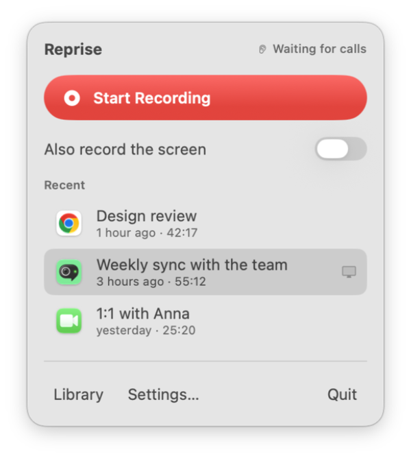
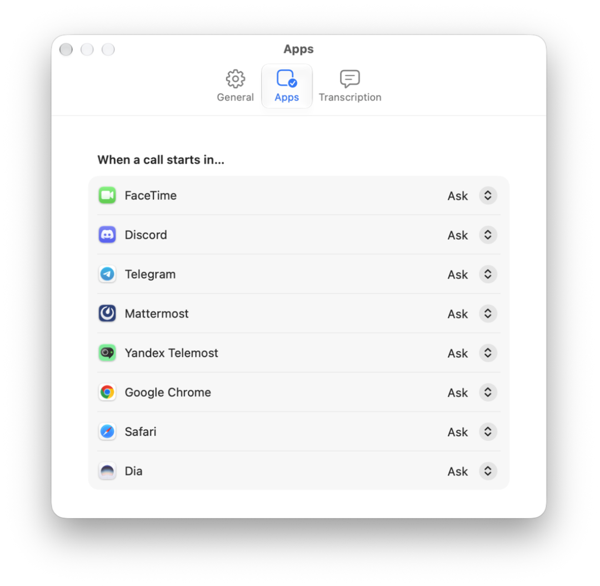
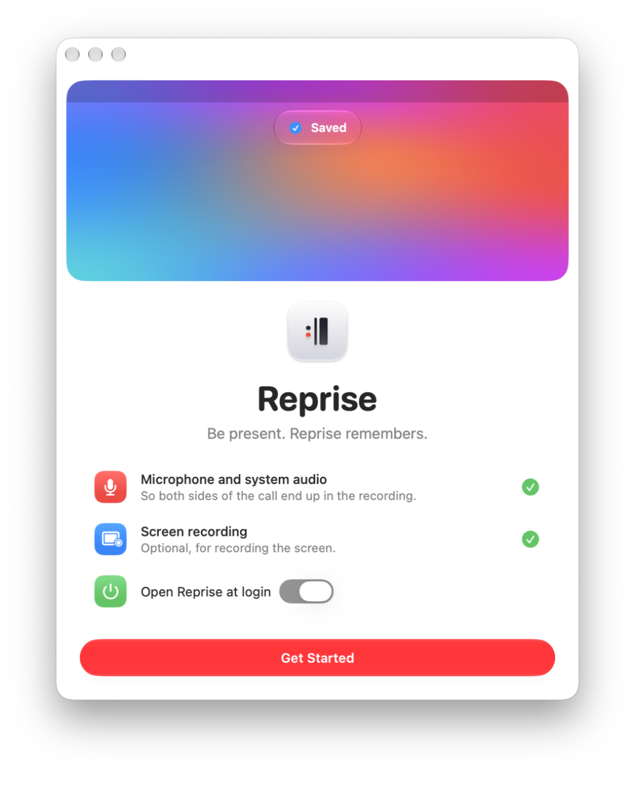
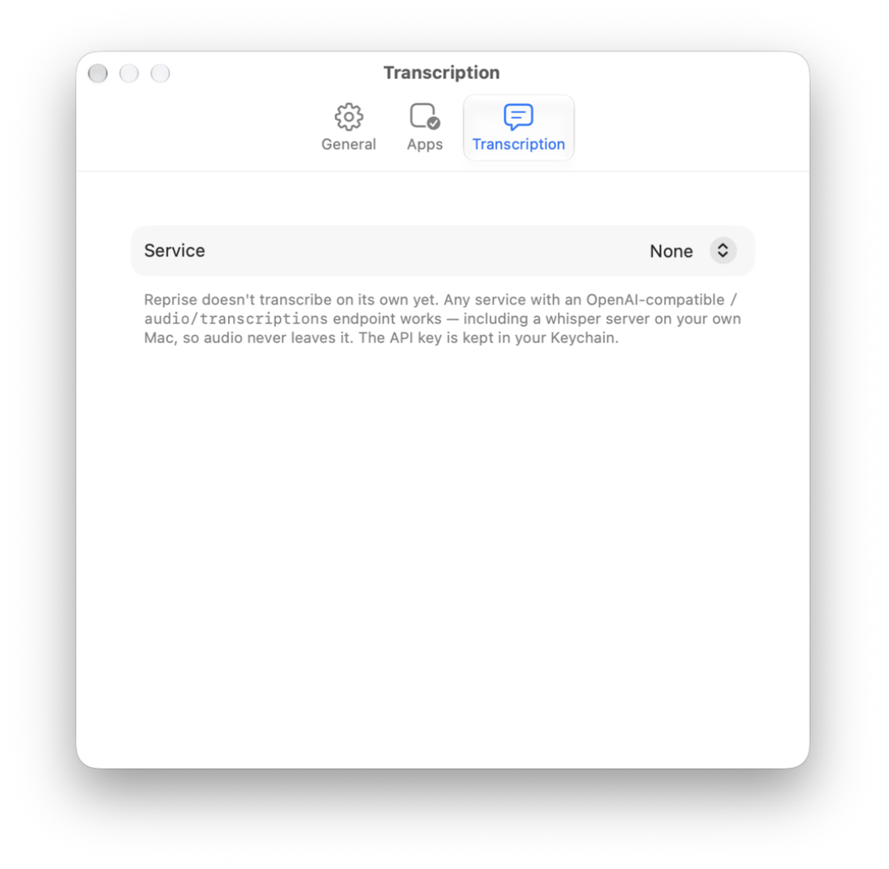

<p align="center">
  
</p>

<h1 align="center">Reprise</h1>

<p align="center"><b>Be present. Reprise remembers.</b><br>
An open-source call recorder for macOS.</p>

<p align="center">
  
</p>

Reprise records the two sides of a call: your voice and the voices of the other persons. It can also record the screen. Reprise keeps all files on your Mac.

## What Reprise does

A *call app* is an app for audio or video calls, for example Google Meet, Zoom, FaceTime, Telegram, or Yandex Telemost.

- Reprise finds calls automatically. When a call app starts to use the microphone, Reprise shows a *prompt* at the top of the screen.
- You select **Record**. Or you set Reprise to record all calls from an app automatically.
- Reprise records your microphone and the audio of the Mac into one file.
- During the recording, a small *pill* shows a red dot and a timer. You can move the pill or hide it.
- Reprise stops the recording when the call ends.
- The library shows all recordings. You can play, search, share, and delete them.
- Reprise can send a recording to a transcription service. This step is optional.

<picture>
  <source media="(prefers-color-scheme: dark)" srcset="docs/media/library-dark.png">
  
</picture>

<p align="center">
  <picture><source media="(prefers-color-scheme: dark)" srcset="docs/media/menu-dark.png"></picture>
  &nbsp;
  <picture><source media="(prefers-color-scheme: dark)" srcset="docs/media/settings-apps-dark.png"></picture>
</p>

## Screenshots

The prompt, the pill during a recording, and the result:

<p align="center">
  <picture><source media="(prefers-color-scheme: dark)" srcset="docs/media/island-prompt-dark.png"></picture><br>
  <picture><source media="(prefers-color-scheme: dark)" srcset="docs/media/island-recording-dark.png"></picture><br>
  <picture><source media="(prefers-color-scheme: dark)" srcset="docs/media/island-saved-dark.png"></picture>
</p>

The first start and the transcription settings:

<p align="center">
  <picture><source media="(prefers-color-scheme: dark)" srcset="docs/media/welcome-dark.png"></picture>
  &nbsp;
  <picture><source media="(prefers-color-scheme: dark)" srcset="docs/media/settings-transcription-dark.png"></picture>
</p>

A video of the prompt and the pill: [docs/media/island.mp4](docs/media/island.mp4).

## Requirements

- macOS 26 or later. We built and tested Reprise on macOS 27.
- Xcode 27, if you build Reprise from the source code. We did not test Xcode 26.

## Install

1. Download the ZIP file from [Releases](https://github.com/nikiomori/reprise/releases/latest).
2. Open the ZIP file.
3. Move `Reprise.app` to the Applications folder.
4. Open Reprise.

Reprise has a Developer ID signature, and Apple notarized it. Thus macOS opens it without a warning.

## Use Reprise

### Record a call

1. Start a call in a call app.
2. Wait for the prompt at the top of the screen.
3. To also record the screen, select the screen button.
4. Select **Record**.

The recording starts. The pill shows at the top of the screen.

> **NOTE:** If you do not select a button, the prompt closes after 20 seconds.

### Stop a recording

1. Put the pointer on the pill. The pill shows more controls.
2. Select the stop button.

If you end the call, Reprise stops the recording automatically.

### Record without a call

1. Click the Reprise icon in the menu bar.
2. Select **Start Recording**.

### Set a rule for a call app

1. Open **Settings > Apps**.
2. For each app, select **Ask**, **Always record**, or **Ignore**.

You can also right-click the prompt and select **Always Record** or **Never Ask**.

Reprise also finds other apps that use the microphone for more than 10 seconds. These apps show in **Settings > Apps** below the list.

### Move or hide the pill

- To move the pill, drag it. Reprise keeps the new position.
- To move the pill to the top center again, right-click it. Then select **Move Back to the Top**.
- To hide the pill until the call ends, right-click it. Then select **Hide Until the Call Ends**.
- To hide the pill for all recordings, open **Settings > General**. Then clear **Show the floating pill while recording**.

### Find a recording

1. Click the Reprise icon in the menu bar.
2. Select **Library**.

The library shows the recordings by day. Use the search field to find a word in a title or in a transcript.

## Transcription

Reprise does not convert speech to text on the Mac yet. It can send the audio to a transcription service that you select.

Reprise uses the OpenAI-compatible endpoint `POST /audio/transcriptions`. Many cloud services and local servers use this endpoint.

| Service | Model | Approximate price for 1 hour |
|---|---|---|
| Groq | `whisper-large-v3-turbo` | $0.04 |
| Mistral | `voxtral-mini-latest` | $0.18 |
| OpenAI | `gpt-4o-transcribe` | $0.36 |
| A local server on your Mac: [speaches](https://github.com/speaches-ai/speaches), WhisperKit, LocalAI, whisper.cpp | Your choice | Free |

To connect a service:

1. Open **Settings > Transcription**.
2. Select a service.
3. Enter your API key. A local server does not need an API key.
4. Optional: enter a language code, for example `en` or `ru`.
5. Optional: select **Transcribe calls automatically**.

Reprise divides long recordings into parts of 10 minutes. This keeps each part below the limits of the services. Reprise keeps the API key in the macOS Keychain.

> **CAUTION:** A cloud service receives the audio of your call. To keep the audio on your Mac, use a local server.

## Permissions

| Permission | Why Reprise needs it |
|---|---|
| Microphone | To record your voice |
| System audio recording | To record the voices of the other persons |
| Screen recording | To record the screen. Reprise needs this permission only for this function. |

> **NOTE:** macOS applies the Screen Recording permission only after the app starts again. After you give this permission, select **Relaunch**.

## Files

Reprise keeps each recording in a folder in `~/Movies/Reprise`:

```
2026-10-06 21.30.12 Google Meet/
├── recording.json   the title, the app, the start time, and the duration
├── audio.m4a        the audio of the call
├── screen.mov       the screen, if you recorded it
└── transcript.txt   the text, if you transcribed the recording
```

During a recording, Reprise writes the audio to `audio.aac`. This format stays usable if the Mac stops unexpectedly. When the recording stops, Reprise changes the file to `audio.m4a`. If a recording stopped unexpectedly, Reprise repairs it at the next start.

When you delete a recording, Reprise moves it to the Trash.

## Build from the source code

1. Clone the repository: `git clone https://github.com/nikiomori/reprise.git`.
2. Open `Reprise.xcodeproj` in Xcode.
3. Select **Product > Run**.

[XcodeGen](https://github.com/yonaskolb/XcodeGen) makes the Xcode project from `project.yml`. If you change `project.yml`, run `xcodegen generate`.

> **NOTE:** By default, the build has an ad-hoc signature. Then macOS asks for the permissions again after each build. To prevent this, sign the build with your team. Create the file `Config/Local.xcconfig` with this text:
>
> ```
> DEVELOPMENT_TEAM = YOURTEAMID
> CODE_SIGN_IDENTITY = Apple Development
> ```

To run the tests, use `xcodebuild -scheme Reprise test`.

## How Reprise works

- **Call detection.** Reprise reads the process list of Core Audio once each second. It finds the apps that use the microphone (`kAudioProcessPropertyIsRunningInput`).
- **Audio.** A private aggregate device connects the microphone and a Core Audio process tap. The tap captures the audio of all apps except Reprise. The two sources use one clock, so they stay in sync.
- **Screen.** ScreenCaptureKit writes the screen and the sound to a movie file (`SCRecordingOutput`).
- **Interface.** Reprise uses SwiftUI and Liquid Glass. It has no third-party dependencies.

[docs/PLAN.md](docs/PLAN.md) gives the full design, the research about transcription, and the roadmap.

## The logo

The logo is the musical repeat sign `:‖`. In music, this sign means "go back and play again". The two dots are the two voices of a call: the gray dot is you, and the red dot is the other person.

## Legal

> **WARNING:** In many countries, the law requires the consent of all persons before you record a call. Tell all persons on the call that you record it.

## License

MIT. See [LICENSE](LICENSE).

---

<sub>This README uses ASD-STE100 Simplified Technical English.</sub>
