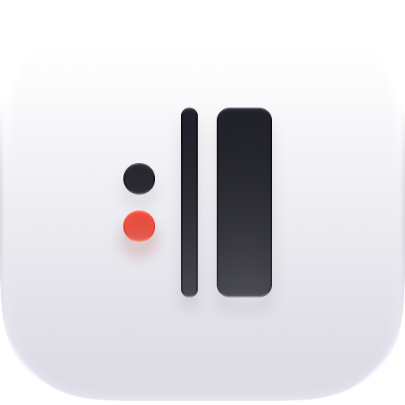
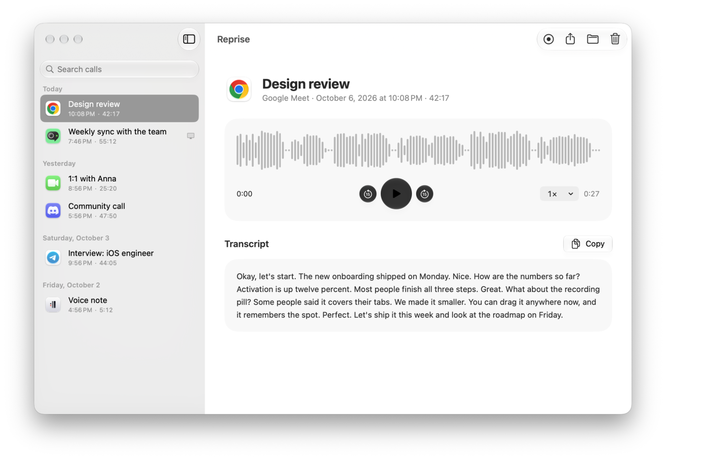
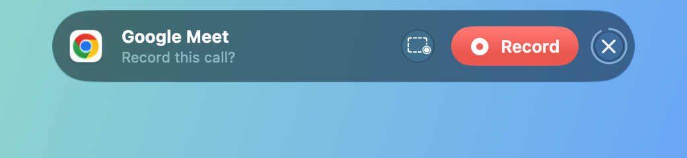

<p align="center">
  
</p>

<h1 align="center">Reprise</h1>

<p align="center"><b>Be present. Reprise remembers.</b><br>
An open-source call recorder for macOS. It records calls, and nothing else.</p>

<p align="center">
  <a href="https://github.com/nikiomori/reprise/releases/latest"><b>Download</b></a> · macOS 26 or later · free, MIT
</p>

<p align="center">
  
</p>

## Why Reprise

Reprise is one tool for one job: recording calls. There is nothing else in it, and everything that is there serves that job. On a call you can listen instead of taking notes, and go back to any moment later. *Reprise* is the musical sign for "play it again".

### One job, done as well as it can be

A call recorder fails in two ways: you forgot to press Record, or an hour later the other side isn't in the file. Reprise is built against both.

- **It doesn't miss a call.** It notices calls by itself and asks once, or records without asking for the apps you choose. It can keep a call from its first second, even if you press Record later. It keeps recording through a lost microphone or a new headset, and repairs a recording cut off by a crash.
- **You see both sides.** While it records, the pill shows the two dots of the logo: one lights up when you speak, the red one when the others do.
- **Plain files.** Each call is a folder of ordinary files on your Mac, ready for any player, editor or script. No account, no cloud, no virtual audio driver.

### Optimized to the limit

A call recorder runs for hours next to the call app, often on battery, so every percent of CPU and every megabyte counts. Measured on Release builds:

| | CPU | Memory |
|---|---|---|
| Waiting for a call in the menu bar | 0.003–0.04% | 20 MB |
| Recording a call, pill on screen | 0.8–1.4% | 25 MB |
| Recording the screen too, with macOS's capture service | 3.5–4% | |

- Between calls Reprise waits for Core Audio events instead of polling, with one safety check every 30 seconds.
- The pill's dots are Core Animation layers, not views redrawn every frame. Before that, recording with the pill took 15–20% CPU.
- The screen is HEVC at a fixed quality: 0.5–6 Mbit/s instead of the 9–47 that macOS's ready-made recorder writes, 6–16 times smaller files that look the same. A still screen costs almost nothing.
- The call's sound goes into the movie without re-encoding, and the microphone is never opened twice.
- The whole app is a 2.7 MB download with no third-party code: SwiftUI and Liquid Glass over Core Audio, ScreenCaptureKit and AVFoundation. Spotlight, Shortcuts, Siri, VoiceOver and Reduce Motion work as they do in Apple's apps.

### Open for good

MIT, no paid version, no account. A call recorder needs your trust, and trust is checked in the code.

## What it does

- Finds calls in Zoom, Google Meet, Microsoft Teams, FaceTime, Slack, Telegram, WhatsApp, [and more](Reprise/Capture/MeetingDetector.swift), in apps and in browsers, and asks **Record this call?** Each app can be set to **Ask**, **Always Record** or **Ignore**.
- Records your microphone and the sound of the Mac into one file, and the screen if you want it.
- Stops when the call ends.
- Keeps every call in a library: play it, search titles and transcripts, share it, drag it into Mail or Finder.
- Optionally sends a call to a transcription service you choose, including one running on your own Mac.

<picture>
  <source media="(prefers-color-scheme: dark)" srcset="docs/media/library-dark.png">
  
</picture>

<p align="center">
  <picture><source media="(prefers-color-scheme: dark)" srcset="docs/media/island-prompt-dark.png"></picture><br>
  <picture><source media="(prefers-color-scheme: dark)" srcset="docs/media/island-recording-dark.png"></picture><br>
  <picture><source media="(prefers-color-scheme: dark)" srcset="docs/media/island-saved-dark.png"></picture>
</p>

## Install

Download the ZIP from [Releases](https://github.com/nikiomori/reprise/releases/latest), open it, and move `Reprise.app` to Applications. Reprise is signed with Developer ID and notarized by Apple. It updates itself: once a day it checks GitHub, and you can turn that off in **Settings > General**.

On first start, Reprise asks for the **Microphone** (your voice) and **System Audio Recording** (the others). **Screen Recording** is needed only to record the screen.

## Tips

- **From the first second.** Turn on **Settings > General > Record calls from the first second**. Reprise then records while it asks. If you don't press Record, that audio is deleted for good.
- **Keyboard, Spotlight and Siri.** Use **Start Recording** and **Stop Recording** from Spotlight, Shortcuts or Siri. For a hotkey, add one to a shortcut in the Shortcuts app.
- **The pill.** Drag it anywhere. Double-click it to hide it until the call ends, and the menu bar shows the time instead.
- **Without a call.** Choose **Start Recording** in the menu bar, or press ⌘N in the library.

## Transcription

Optional. Reprise sends the audio, in 10-minute parts, to any service with the OpenAI-compatible `POST /audio/transcriptions` endpoint. Set it up in **Settings > Transcription**. The API key stays in the Keychain.

| Service | Model | About 1 hour |
|---|---|---|
| Groq | `whisper-large-v3-turbo` | $0.04 |
| Mistral | `voxtral-mini-latest` | $0.18 |
| OpenAI | `gpt-4o-transcribe` | $0.36 |
| A local server: [speaches](https://github.com/speaches-ai/speaches), WhisperKit, LocalAI, whisper.cpp | Your choice | Free |

A cloud service receives the audio of your call. To keep it on your Mac, use a local server.

## Files

Each call is a folder in `~/Movies/Reprise`:

```
2026-10-06 21.30.12 Google Meet/
├── recording.json   title, app, start time, duration
├── audio.m4a        the call
├── screen.mov       the screen, if you recorded it
└── transcript.txt   the text, if you transcribed it
```

While Reprise records, the sound goes to a stream that survives a crash or a power loss, and the movie is written in 5-second parts. Reprise repairs a cut-off recording at the next start. A deleted call goes to the Trash.

## Build from source

You need Xcode 27. Clone the repository, open `Reprise.xcodeproj` and run it. The project is generated from `project.yml` by [XcodeGen](https://github.com/yonaskolb/XcodeGen), so run `xcodegen generate` after you change it. To run the tests: `xcodebuild -scheme Reprise test`.

A build is signed ad hoc, so macOS asks for the permissions again after each build. To keep them, sign with your team in `Config/Local.xcconfig`, which git ignores:

```
DEVELOPMENT_TEAM = YOURTEAMID
CODE_SIGN_IDENTITY = Apple Development
```

## How it works

- **Detection.** Core Audio tells Reprise when an app starts or stops audio, and Reprise looks at which apps hold the microphone.
- **Audio.** A private aggregate device joins the microphone and a Core Audio process tap on one clock, so the two sides never drift apart. The tap can take only the call app's sound.
- **Headphones.** Reprise never opens a Bluetooth headset's microphone itself, so it never pushes headphones into call mode.

The full design, research and roadmap are in [docs/PLAN.md](docs/PLAN.md).

## Legal

> **WARNING:** In many countries, the law requires the consent of all persons before you record a call. Tell everyone on the call that you record it.

## License

MIT. See [LICENSE](LICENSE).
